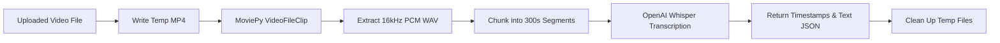

# 🎙️ Video Transcription API (FastAPI + OpenAI Whisper)

[](https://fastapi.tiangolo.com/)
[](https://www.python.org/)
[](https://github.com/openai/whisper)
[](https://zulko.github.io/moviepy/)
[](LICENSE)

A high-performance Python microservice powered by **FastAPI**, **OpenAI Whisper**, and **MoviePy**. It ingests uploaded video files, extracts normalized 16kHz audio, chunks audio into optimized 5-minute blocks, and performs automatic speech-to-text (STT) transcription with precise start and end timestamps.

---

## 📑 Table of Contents

- [Overview & Ecosystem Role](#-overview--ecosystem-role)
- [Key Features](#-key-features)
- [Architecture & Processing Flow](#-architecture--processing-flow)
- [Prerequisites](#-prerequisites)
- [Installation & Setup](#-installation--setup)
- [Running the Service](#-running-the-service)
- [API Reference](#-api-reference)
- [Configuration & Whisper Models](#-configuration--whisper-models)
- [License](#-license)

---

## 🌐 Overview & Ecosystem Role

This service is part of the **AI Video Transcription & Quiz Generator** ecosystem:

1. **`video-transcription-api`** *(This service)*: Speech-to-text microservice running on port `8000`.
2. [**`transcription-backend`**](../transcription-backend/): NestJS orchestration backend on port `3000` (sends uploaded videos here and handles LLM question generation with Ollama).
3. [**`video-transcription-app`**](../video-transcription-app/): React frontend on port `3001` (user UI for uploading videos, viewing timestamped transcripts, and taking generated quizzes).

> 💡 **Tip**: To run the entire platform, all three services (`video-transcription-api`, `transcription-backend`, `video-transcription-app`) alongside MongoDB and Ollama should be running simultaneously.

---

## ✨ Key Features

- **Multi-Format Support**: Handles MP4, MKV, MOV, WebM, AVI, and audio formats.
- **Automated Audio Extraction**: Extracts audio tracks and converts them to 16kHz PCM WAV format via MoviePy.
- **Smart Chunking**: Splits audio into 300-second (5-minute) chunks to prevent memory overhead and handle long video recordings reliably.
- **OpenAI Whisper Powered**: Uses OpenAI's state-of-the-art speech recognition model (`base` by default, configurable to `tiny`, `small`, `medium`, or `large`).
- **Timestamped Transcripts**: Outputs segmented text with exact `start` and `end` times in seconds.
- **Automatic Cleanup**: Automatically deletes temporary uploaded video files and intermediate audio chunks.
- **CORS Enabled**: Configured to accept cross-origin requests from the React frontend or backend services.

---

## 🏗️ Architecture & Processing Flow



---

## 📋 Prerequisites

Before running this service, ensure you have installed:

1. **Python**: Version `3.10` or higher (`3.10`, `3.11`, `3.12` recommended)
2. **FFmpeg**: Required by MoviePy and Whisper for media decoding:
   - **macOS** (Homebrew):
     ```bash
     brew install ffmpeg
     ```
   - **Ubuntu / Debian**:
     ```bash
     sudo apt update && sudo apt install ffmpeg
     ```
   - **Windows** (Chocolatey / Scoop):
     ```bash
     choco install ffmpeg
     ```
3. **Git**: Required to install Whisper directly from GitHub.

---

## 🚀 Installation & Setup

1. **Navigate to this directory**:
   ```bash
   cd video-transcription-api
   ```

2. **Create and activate a Python virtual environment**:
   ```bash
   # Create virtual environment
   python3 -m venv venv

   # Activate virtual environment (macOS/Linux):
   source venv/bin/activate

   # Activate virtual environment (Windows):
   # venv\Scripts\activate
   ```

3. **Upgrade pip and build tools**:
   ```bash
   pip install --upgrade pip setuptools wheel
   ```

4. **Install dependencies**:
   ```bash
   pip install -r requirements.txt
   ```

   *Alternatively, if installing manually:*
   ```bash
   pip install fastapi uvicorn moviepy==1.0.3 pydub python-multipart torch git+https://github.com/openai/whisper.git
   ```

---

## 🏃 Running the Service

Start the FastAPI development server with Uvicorn:

```bash
# Option 1: Direct Python execution (runs on port 8000 by default)
python main.py

# Option 2: Using Uvicorn CLI directly with hot-reload
uvicorn main:app --host 0.0.0.0 --port 8000 --reload
```

Once running:
- **API Root**: [http://localhost:8000](http://localhost:8000)
- **Interactive Swagger Docs**: [http://localhost:8000/docs](http://localhost:8000/docs)
- **ReDoc Documentation**: [http://localhost:8000/redoc](http://localhost:8000/redoc)

---

## 🔌 API Reference

### 1. Health Check
Checks if the transcription service is alive and ready.

- **Endpoint**: `GET /`
- **Response**:
  ```json
  {
    "message": "Video Transcription API is running"
  }
  ```

---

### 2. Transcribe Video / Audio
Transcribes an uploaded video or audio file and returns timestamped segments.

- **Endpoint**: `POST /transcribe`
- **Content-Type**: `multipart/form-data`
- **Request Body**:
  - `file` (*required*, binary file): The media file to transcribe.

**cURL Example**:
```bash
curl -X POST "http://localhost:8000/transcribe" \
  -H "accept: application/json" \
  -H "Content-Type: multipart/form-data" \
  -F "file=@sample_lecture.mp4"
```

**Response Format** (`200 OK`):
```json
{
  "duration": 45.2,
  "segments": [
    {
      "start": 0,
      "end": 45.2,
      "text": " Welcome to our introductory lecture on distributed systems and cloud architecture."
    }
  ]
}
```

---

## ⚙️ Configuration & Whisper Models

The Whisper model is loaded in `main.py`:

```python
model = whisper.load_model("base")
```

You can change `"base"` to any available Whisper model depending on your hardware and accuracy requirements:

| Model | Parameters | Required VRAM / RAM | Relative Speed | English Accuracy |
| :--- | :--- | :--- | :--- | :--- |
| `tiny` | 39 M | ~1 GB | ~32x | Moderate |
| `base` *(default)* | 74 M | ~1 GB | ~16x | Good |
| `small` | 244 M | ~2 GB | ~6x | Very Good |
| `medium` | 769 M | ~5 GB | ~2x | High |
| `large` | 1550 M | ~10 GB | 1x | State of the Art |

> 🚀 **GPU Acceleration**: If a CUDA-enabled NVIDIA GPU or Apple Silicon (MPS) device is present, PyTorch will automatically utilize acceleration for faster transcription.

---

## 📄 License

This project is open source and available under the [MIT License](LICENSE).
